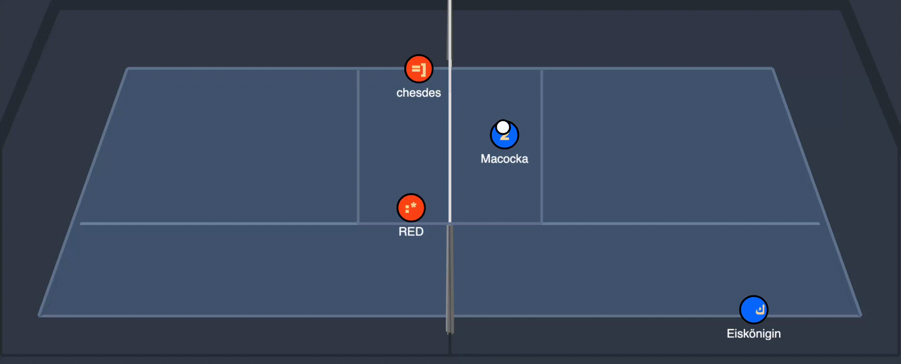
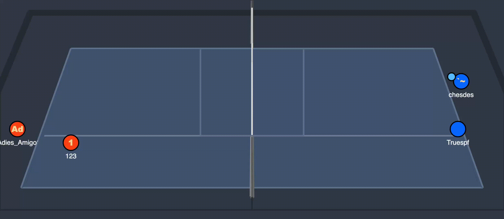
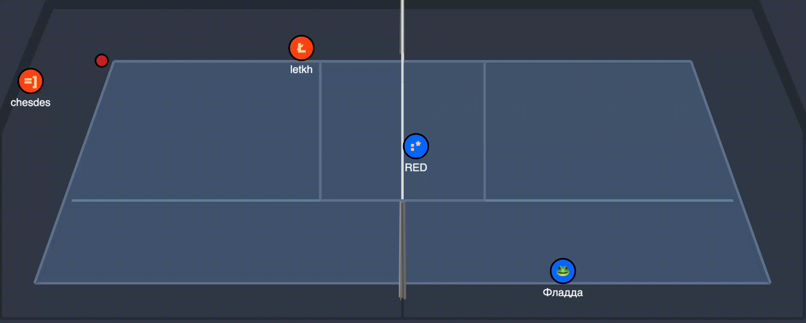
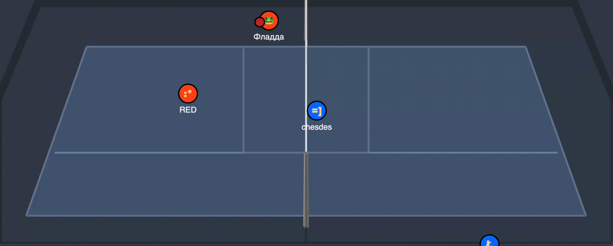

# 🏐 Volleyball \[chds\] — a [HaxBall](https://www.haxball.com) room bot.
**Languages: [🇬🇧 English](#english) | [🇷🇺 Русский](#русский)**

<a id="english"></a>
## README 🇬🇧

Bot for a [HaxBall](https://www.haxball.com) room implementing a full volleyball game mode: touch counting, blocks, power serves, aces, automatic team forming, and an admin role system.

The bot runs two rooms at once — **public** and **private** — via two independent headless browser instances, plus a single Discord bot process shared by both rooms. Moderation and stats viewing can be handled either through in-room chat commands or through Discord slash commands — both work off the same database and the same role hierarchy.

### Game features

#### Game mechanics

- **Volleyball rules**: max 3 touches per team in a row, no double-touch by the same player, automatic goal/fault detection.

  

- **Power serves** (`!serve` / `!sr`) — the team whose turn it is to serve sends the ball with a boosted kick; a successful serve that crosses the net untouched counts as an **ACE**.

  

- **Blocks** — counted when a player deflects the opponent's ball in a designated zone near the net; tracked separately from regular touches.

  

- **Save ball** — the third touch in the out zone is highlighted and physically boosted, and this hit can't be blocked, giving the team a chance to escape a difficult position.

  

- **Match point** with auto-extension: if the score ties at the expected match point, the game continues until there's a two-point lead.

- **Training mode** (private room mode only, `!training` / `!tr`) — a goal-less map with a configurable auto ball spawner (`!ball_spawner` / `!bs`: position, speed, interval, or ready-made serve presets `serve_red`/`serve_blue`) for practicing serves and receives.

  

#### Teams and queue

- Automatic team forming: **random** mode or **captains** mode (captains take turns picking players from spectators), switched via `!teampick` / `!tp`.
- **Winstay** (`!winstay`) — the winning team stays on the field, continuing to play in the same lineup (roster match is judged by a 2/3-majority rule) until it loses.
- Spectator queue prioritized by number of missed games, plus a separate **VIP queue**.
- Team size automatically adjusts to the number of active players (`!team_size` / `!ts` to set manually).
- `!up` — a VIP+ command letting a player book a captain slot for the next captains-mode formation, with a room-wide cooldown. If the player who booked isn't present anymore by the time picking starts, the booking is simply dropped.

#### Roles and moderation

- Role hierarchy: `PLAYER → VIP → PREADMIN → ADMIN → MASTER`, with automatic timed role expiry.
- Bans and mutes with duration and reason, reported to Discord.
- Ability to enable a mode where only players from the whitelisted public ID list (`!add_auth`) can join.
- Colored chat nickname for VIP and above (`!color`).
- A separate VIP password, refreshed hourly and set on the room once a certain number of VIP slots remain, letting VIP players enter an otherwise "full" room.
- `!account` — view your own account (role, expiry date, linked Discord) or, for ADMIN and above, another player's by `#ID` or public ID.

#### Stats and social features

- Personal stats: games, wins, goals, blocks, percentage of blocks beaten (POB), assists, errors, aces, serves, play time.
- Player leaderboards for any tracked stat (`!tops`).
- Nickname history (`!deanon`) to recognize players by past nicknames.

#### Discord integration

The bot connects to Discord as a real bot application (not webhooks), which provides:

- **Account linking** (`/link` in Discord + `!discord <code>` in the room) — ties a player's HaxBall public ID to their Discord account. `!discordunlink` / `/unlink` undo it.
- **Automatic role sync** — when a player's in-room role (`VIP`/`PREADMIN`/`ADMIN`/`MASTER`) is granted, changed, expires, or the player rejoins the room, their Discord role is granted or revoked to match, as long as their Discord is linked and they're a member of the configured guild.
- **Live online status message** — an embed in a dedicated Discord channel is edited once a minute and shows the room name, current player count, the list of players online, and a **"Присоединиться" (Join)** link button pointing at the current room link.
- Chat/event logs, ban/mute reports, and auto-uploaded match replays go to dedicated Discord channels.
- **Slash commands mirroring moderation and stats lookup**, with access gated by the same in-room role hierarchy, checked against the caller's linked account:
  - `MASTER`: `/setrole`, `/getrolelist`, `/password`, `/statsclear`
  - `ADMIN`: `/ban`, `/unban`, `/mute`, `/unmute`, `/bans`, `/mutes`
  - Any linked account (`PLAYER`+): `/tops`, `/stats`, `/account`

  Commands targeting a specific player take their public ID (43 characters) directly, with no nickname resolution. The exception is `/stats`: it's read-only and additionally supports looking a player up by nickname (if several accounts share that nickname, a list is shown with an `index` to disambiguate on a re-run). `/ban`, `/unban`, `/mute`, `/unmute`, and `/password` first write the change to the DB/state, then apply it **instantly, live**, in whichever room the target currently is, via the Node→browser bridge (`window.__applyModeration`) — no need to wait for the player to rejoin.

### Architecture

The project runs across two processes:

```
Node.js (main.js → src/index.js)
   │
   │  launches headless Chrome via Puppeteer,
   │  opens haxball.com/headless,
   │  logs in a single Discord bot client shared by both rooms
   │
   ▼
Browser context (src/browser/entry.js)
   │
   │  esbuild bundles entry.js + the whole src/core tree
   │  into a single IIFE bundle and injects it into the page
   │
   ▼
HaxBall Room API (HBInit)
```

- The **Node side** is responsible for the browser lifecycle, bundle building (esbuild), the single access point to SQLite — `window.__dbCall`, exposed to the browser via `page.exposeFunction` — and the single access point to Discord — `window.__discordCall`, exposed the same way. The Discord bot client itself lives here too, including slash-command registration and handling.
- The **browser side** (all code under `src/core/*`) is plain JS with no Node APIs, bundled by esbuild and run inside the HaxBall page. DB calls go asynchronously through the bridge `window.__db.*` → `__dbCall` → Node → SQLite. Discord calls go the same way through `window.__discord.*` → `__discordCall` → Node → the `discord.js` client.
- The Discord bot itself (login, slash commands, role management, message editing) only exists on the Node side — it never gets bundled into the browser context, since a real Gateway connection needs Node APIs that aren't available in the page's sandbox.
- A **reverse bridge** runs the other way: `src/index.js` exposes `applyModeration` (broadcast to both rooms) and `applyToRoom` (targeted at one room) to the Discord slash-command layer, which call `window.__applyModeration(action)` inside the relevant page(s) via `page.evaluate` — no `page.exposeFunction` registration is needed for this direction, since `page.evaluate` can always reach into the page's global scope from the Node side.

#### Directory layout

```
main.js                  — entry point, loads .env
src/
  index.js                — launches Puppeteer, builds the bundle, DB and Discord bridges, boots the Discord bot, wires up the moderation bridges
  browser/
    entry.js               — entry point in the browser context, wires up all the modules, exposes window.__applyModeration
  core/
    config.js               — secrets and tokens from process.env
    roomConstants.js         — public/private room configs
    maps.js                  — stadium maps (with goals / without goals)
    announcementMessages.js  — rotating promo announcements
    safeEventHandlers.js     — wraps room.onX with error catching
    discordBot.js            — Node-only Discord bot client (discord.js): login, slash-command registration/handling, link codes, role sync, channel messages, online embed
    discordCommands.js       — slash-command definitions and handlers
    models/
      enums.js                — Role, Color, Team, Mods, Sits, etc.
      models.js                — Game, MuteList, MutePlayer
    utils/
      utils.js                 — various utility functions
      roomUtils.js              — utility functions that need the room object to work
      roles.js                  — getRole/setRole/checkRoles (DB-backed, triggers Discord role sync)
      discord.js                — thin browser-side bridge, forwards calls to window.__discord.*
      spawnRange.js             — parses "min..max" range syntax for training-mode spawn parameters
      reports.js                — replay file naming
    services/
      chat.js                   — command/alias resolution
      captains.js                — captain-pick logic
      updates.js                 — team forming, winstay, randomizer, VIP `!up` booking resolution
      intervals.js                — all setInterval loops (bans, mutes, roles, announcements, online embed, game tick)
      training.js                 — training-mode ball spawner
      accounts.js                 — account view formatting (`!account`/`/account`) and target-auth resolution
    commands/
      commands.js                 — command registry → role → handler
      player.js, vip.js, admin.js, master.js — command implementations by access tier
    events/
      movement.js, activity.js, game.js, misc.js — room event handlers
db/
  sqlite.js               — wrapper over node:sqlite (DatabaseSync), schema and queries
scripts/
  add-master.js             — one-off MASTER role grant directly in the DB
  send-online-messages.js    — one-off: posts the two initializing messages that the bot later edits into the live online embeds
tools/
  smoke-test.js             — in-memory smoke tests for the DB layer and role logic
.github/workflows/
  ci.yaml                    — runs smoke tests on push/PR
  deploy.yaml                 — deploys to a self-hosted runner via pm2
```

#### Storage

SQLite via the built-in `node:sqlite` module (`db/volleyball.sqlite`, WAL mode). Tables: `accounts`, `bans`, `mutes`, `nicknames`, `auths`, `stats`. `db/sqlite.js` is the only place with raw SQL; the browser side only ever sees promisified methods, and the Discord slash-command handlers call the same `db` instance directly on the Node side. The `accounts.discord` column stores the linked Discord user ID once a player links their account.

#### DB access boundary

`page.evaluate` registers an **explicit whitelist** of methods reachable from the browser (`getBans`, `setRole`, `incrementStat`, `setDiscordId`, `getAccountByDiscordId`, etc.) — browser code can't call an arbitrary `db` method, only the ones listed in `src/index.js`. The same explicit-whitelist approach is used for the Discord bridge (`sendLog`, `syncRoleForAuth`, `consumeLinkCode`, `updateOnlineMessage`, etc.).

### Requirements

- Node.js **≥ 22.18** (uses the native `node:sqlite` module)
- npm
- A Discord bot application (see setup below)

### Installation

```bash
git clone <repo-url>
cd volleyball
npm install
cp .env.example .env
```

Fill in `.env`:

```ini
PUBLIC_TOKEN="token here"
PRIVATE_TOKEN="token here"
PUBLIC_PASSWORD="password or empty here"
PRIVATE_PASSWORD="password or empty here"

DISCORD_BOT_TOKEN="discord bot token here"
DISCORD_GUILD_ID="your server id here"

DISCORD_VIP_ROLE_ID="discord role id"
DISCORD_PREADMIN_ROLE_ID="discord role id"
DISCORD_ADMIN_ROLE_ID="discord role id"
DISCORD_MASTER_ROLE_ID="discord role id"

DISCORD_LOG_CHANNEL_ID="discord channel id"
DISCORD_REPORT_CHANNEL_ID="discord channel id"
DISCORD_REPLAY_CHANNEL_ID="discord channel id"
DISCORD_VIP_CHANNEL_ID="discord channel id"

DISCORD_PUBLIC_ONLINE_CHANNEL_ID="discord channel id"
DISCORD_PUBLIC_ONLINE_MESSAGE_ID="filled in after running scripts/send-online-messages.js"
DISCORD_PRIVATE_ONLINE_CHANNEL_ID="discord channel id"
DISCORD_PRIVATE_ONLINE_MESSAGE_ID="filled in after running scripts/send-online-messages.js"
```

`PUBLIC_TOKEN`/`PRIVATE_TOKEN` are the HaxBall headless tokens for the respective room.

#### Discord bot setup

1. Create an application at the [Discord Developer Portal](https://discord.com/developers/applications), add a Bot user, and copy its token into `DISCORD_BOT_TOKEN`.
2. Under **Bot**, enable the **Server Members Intent** — required for role management (`guild.members.fetch`).
3. Under **OAuth2 → URL Generator**, select scopes `bot` and `applications.commands`, with permissions at least `Manage Roles`, `Send Messages`, `Attach Files`, `Read Message History`. Use the generated link to invite the bot to your server.
4. Create (or reuse) four Discord roles matching `VIP`/`PREADMIN`/`ADMIN`/`MASTER`. **The bot's own role must sit above all four in the server's role list**, or Discord won't let it grant/revoke them. Copy each role's ID into `.env`.
5. Create (or reuse) channels for logs, moderation reports, replays, and the VIP password, and copy their IDs into `.env`.
6. Create (or reuse) one channel per room (public/private) for the live online status message, and fill in `DISCORD_PUBLIC_ONLINE_CHANNEL_ID` / `DISCORD_PRIVATE_ONLINE_CHANNEL_ID`.
7. Run `node scripts/send-online-messages.js` once — it logs in as the bot and posts one initializing message per room into the channels from step 6 (the bot can only edit its own messages, so these need to exist before the bot can start updating them). Copy the two printed message IDs into `DISCORD_PUBLIC_ONLINE_MESSAGE_ID` / `DISCORD_PRIVATE_ONLINE_MESSAGE_ID`.
8. On startup, the bot registers its slash commands (`/link`, `/unlink`, and the role-gated moderation/lookup commands listed above) as guild commands for `DISCORD_GUILD_ID`.

### Running

```bash
npm start
```

Runs `main.js`, which logs in the Discord bot, then launches **both** rooms (public + private) in parallel. Room links and the VIP password will appear in the console log. Once a room is up, its Discord online-status embed will start updating (once a minute) with the current player count, the player list, and a join button.

#### Granting the MASTER role

The first master has to be granted manually, since `!setrole` (and `/setrole`) doesn't allow assigning this role:

```bash
node scripts/add-master.js <public_id>
```

The bot needs to be restarted for the change to take effect.

#### Linking a Discord account

1. In Discord, run `/link`. The bot replies (visible only to you) with a short code and instructions.
2. In the HaxBall room, run `!discord <code>` with that code.
3. On success, the player's HaxBall `auth` is tied to their Discord ID (stored in `accounts.discord`), and any role they already hold is immediately synced to Discord.
4. To unlink — run `/unlink` in Discord, or `!discordunlink` in the room (admins can also unlink another player's account: `!discordunlink <#ID | AUTH>`).

Linking an account is also what unlocks the player-tier Discord slash commands (`/tops`, `/stats`, `/account`) and, for higher roles, the moderation ones — access is checked against the linked account's in-room role every time a command runs.

### Tests

```bash
npm run test:smoke
```

In-memory smoke tests (`tools/smoke-test.js`) cover the DB layer (accounts, bans, stats, nicknames, mutes) and part of the business logic (`MuteList`, `getRole`/`setRole`). They run in CI on every push and PR (`.github/workflows/ci.yaml`).

### Deployment

`.github/workflows/deploy.yaml`, on push to `main`, does `git reset --hard`, `npm ci`, and restarts the process via `pm2` on a self-hosted runner.

---

<a id="русский"></a>
## README 🇷🇺

Бот для комнаты [HaxBall](https://www.haxball.com), реализующий полноценный режим волейбола: подсчёт касаний, блоки, силовые подачи, эйсы, автоматическое формирование команд и систему ролей администрации.

Бот управляет двумя комнатами одновременно — **публичной** и **приватной** — через два независимых экземпляра headless-браузера, а также одним общим процессом Discord-бота на обе комнаты. Модерацию и просмотр статистики можно вести как через команды в чате комнаты, так и через slash-команды Discord — оба канала работают с одной и той же базой и одной иерархией ролей.

### Особенности режима

#### Игровая механика

- **Волейбольные правила**: не более 3 касаний на команду подряд, запрет двойного касания одним игроком, автоматическое определение гола/фола.

  

- **Силовые подачи** (`!serve` / `!sr`) — команда, чей черёд подавать, отправляет мяч ускоренным ударом; успешная подача через сетку без касания соперником засчитывается как **ЭЙС**.

  

- **Блоки** — засчитываются, если игрок отбивает мяч соперника в специальной зоне у сетки; учитываются раздельно от обычных касаний.

  

- **Сейв-мяч** — третье касание в аутовой зоне подсвечивается и физически усиливается, также этот удар нельзя блокировать, чтобы дать команде шанс спастись из сложного положения.

  

- **Матч-поинт** с автопродлением: если счёт сравнивается на предполагаемом матч-поинте, игра продолжается до перевеса.

- **Тренировочный режим** (только в приватном моде комнаты, `!training` / `!tr`) — карта без ворот и настраиваемый автоспавнер мяча (`!ball_spawner` / `!bs`: позиция, скорость, интервал, либо готовые пресеты подачи `serve_red`/`serve_blue`) для отработки подач и приёма.

  

#### Команды и очередь

- Автоматическое формирование команд: **случайный** режим или режим **капитанов** (капитаны по очереди выбирают игроков из зрителей), переключается командой `!teampick` / `!tp`.
- **Winstay** (`!winstay`) — команда-победитель остаётся на поле, продолжая играть в таком же составе (совпадение состава считается по правилу большинства 2/3) пока не проиграет.
- Очередь зрителей с приоритетом по количеству пропущенных игр и отдельной **VIP-очередью**.
- Автоматическое подстраивание размера команд под количество активных игроков (`!team_size` / `!ts` — задать вручную).
- `!up` — команда для VIP и выше, позволяющая забронировать место капитана на следующем формировании команд в режиме капитанов, с общим кулдауном на комнату. Если забронировавший игрок к моменту пика отсутствует, бронь просто аннулируется.

#### Роли и модерация

- Иерархия ролей: `PLAYER → VIP → PREADMIN → ADMIN → MASTER`, с автоматическим временным истечением роли.
- Баны и муты с указанием времени и причины, отчётность в Discord.
- Возможность включить режим, когда зайти смогут только игроки из списка авторизованных публичных ID (`!add_auth`).
- Цветной никнейм в чате для VIP и выше (`!color`).
- Отдельный VIP-пароль, который обновляется раз в час и устанавливается на комнату когда осталось определенное количество VIP слотов, позволяя VIP игрокам входить в "заполненную" комнату.
- `!account` — посмотреть свой аккаунт (роль, срок действия, привязанный Discord) либо, для ADMIN и выше, чужой по `#ID` или public ID.

#### Статистика и социальные функции

- Персональная статистика: игры, победы, голы, блоки, процент обойденных блоков (ПОБ), пасы, ошибки, эйсы, подачи, игровое время.
- Топы игроков по любому из показателей (`!tops`).
- История никнеймов (`!deanon`) для узнавания игроков по прошлым никам.

#### Discord-интеграция

Бот подключается к Discord как полноценное bot-приложение (не через вебхуки), что даёт:

- **Привязку аккаунта** (`/link` в Discord + `!discord <код>` в комнате) — связывает публичный ID игрока в HaxBall с его Discord-аккаунтом. `!discordunlink` / `/unlink` отвязывают её обратно.
- **Автоматическую синхронизацию ролей** — при выдаче, изменении, истечении роли (`VIP`/`PREADMIN`/`ADMIN`/`MASTER`), а также при каждом заходе игрока в комнату, его Discord-роль выдаётся или снимается автоматически, если Discord привязан и игрок состоит в настроенной гильдии.
- **Живое сообщение об онлайне** — embed в отдельном Discord-канале редактируется раз в минуту и показывает название комнаты, текущее число игроков, список игроков онлайн и кнопку-ссылку **"Присоединиться"** на текущую ссылку комнаты.
- Логи чата и событий, отчёты о банах/мутах и авто-отправка реплеев матчей идут в выделенные Discord-каналы.
- **Slash-команды, зеркалирующие модерацию и просмотр статистики**, с доступом по той же иерархии ролей, что и в комнате, через привязанный Discord-аккаунт:
  - `MASTER`: `/setrole`, `/getrolelist`, `/password`, `/statsclear`
  - `ADMIN`: `/ban`, `/unban`, `/mute`, `/unmute`, `/bans`, `/mutes`
  - Любой привязанный аккаунт (`PLAYER`+): `/tops`, `/stats`, `/account`

  Команды, нацеленные на конкретного игрока, принимают его public ID (43 символа) напрямую, без резолвинга по нику. Исключение — `/stats`: она доступна только на чтение и дополнительно поддерживает поиск игрока по нику (при совпадении у нескольких аккаунтов показывается список с `index`, чтобы уточнить повторным вызовом). `/ban`, `/unban`, `/mute`, `/unmute` и `/password` сначала пишут изменение в БД/состояние, а затем применяют его **мгновенно вживую** в той комнате, где сейчас находится цель, через мост Node→browser (`window.__applyModeration`) — без ожидания перезахода игрока.

### Архитектура

Проект работает в двух процессах:

```
Node.js (main.js → src/index.js)
   │
   │  запускает headless Chrome через Puppeteer,
   │  открывает haxball.com/headless,
   │  логинит единый Discord-бот, общий на обе комнаты
   │
   ▼
Browser context (src/browser/entry.js)
   │
   │  esbuild собирает entry.js + всё дерево src/core
   │  в один IIFE-бандл и инжектит в страницу
   │
   ▼
HaxBall Room API (HBInit)
```

- **Node-сторона** отвечает за жизненный цикл браузера, сборку бандла (esbuild), единственную точку доступа к SQLite — `window.__dbCall`, проброшенную в браузер через `page.exposeFunction`, — и единственную точку доступа к Discord — `window.__discordCall`, проброшенную так же. Здесь же живёт сам клиент Discord-бота, включая регистрацию и обработку slash-команд.
- **Browser-сторона** (весь код в `src/core/*`) — чистый JS без Node-API, собирается esbuild'ом и исполняется внутри страницы HaxBall. Обращения к БД идут асинхронно через мост `window.__db.*` → `__dbCall` → Node → SQLite. Обращения к Discord идут так же через `window.__discord.*` → `__discordCall` → Node → клиент `discord.js`.
- Сам Discord-бот (логин, slash-команды, управление ролями, редактирование сообщений) существует только на Node-стороне — в бандл браузера он никогда не попадает, поскольку для реального Gateway-соединения нужны Node-API, которых нет в песочнице страницы.
- В обратную сторону работает **reverse-мост**: `src/index.js` пробрасывает в слой Discord slash-команд функции `applyModeration` (широковещательно на обе комнаты) и `applyToRoom` (в конкретную комнату), которые вызывают `window.__applyModeration(action)` внутри нужной страницы(-иц) через `page.evaluate` — регистрация через `page.exposeFunction` для этого направления не нужна, так как `page.evaluate` всегда может обратиться к глобальной области страницы со стороны Node.

#### Структура каталогов

```
main.js                  — точка входа, подгружает .env
src/
  index.js                — запуск Puppeteer, сборка бандла, мосты к БД и Discord, запуск Discord-бота, подключение мостов модерации
  browser/
    entry.js               — точка входа в браузерном контексте, DI всех модулей, экспонирует window.__applyModeration
  core/
    config.js               — секреты и токены из process.env
    roomConstants.js         — конфиги public/private комнат
    maps.js                  — карты стадиона (с воротами / без ворот)
    announcementMessages.js  — ротация рекламных объявлений
    safeEventHandlers.js     — обёртка room.onX с перехватом ошибок
    discordBot.js            — Node-only клиент Discord-бота (discord.js): логин, регистрация/обработка slash-команд, коды привязки, синк ролей, сообщения в каналах, онлайн-embed
    discordCommands.js       — описания и обработчики slash-команд
    models/
      enums.js                — Role, Color, Team, Mods, Sits и т.д.
      models.js                — Game, MuteList, MutePlayer
    utils/
      utils.js                 — различные функции утилиты
      roomUtils.js              — функции утилиты, которые для своей работы требуют объект room
      roles.js                  — getRole/setRole/checkRoles (с БД, запускает синк ролей в Discord)
      discord.js                — тонкий мост на браузерной стороне, пробрасывает вызовы в window.__discord.*
      spawnRange.js             — парсинг синтаксиса диапазонов "min..max" для параметров спавна в тренировочном режиме
      reports.js                — имена файлов реплеев
    services/
      chat.js                   — резолвинг команд/алиасов
      captains.js                — логика выбора капитанами
      updates.js                 — формирование команд, winstay, рандомайзер, резолвинг брони VIP `!up`
      intervals.js                — все setInterval (баны, муты, роли, объявления, онлайн-embed, тик игры)
      training.js                 — автоспавнер мяча в тренировочном режиме
      accounts.js                 — форматирование просмотра аккаунта (`!account`/`/account`) и резолвинг целевого auth
    commands/
      commands.js                 — реестр команд → роль → функция
      player.js, vip.js, admin.js, master.js — реализации команд по уровню доступа
    events/
      movement.js, activity.js, game.js, misc.js — обработчики событий комнаты
db/
  sqlite.js               — обёртка над node:sqlite (DatabaseSync), схема и запросы
scripts/
  add-master.js             — разовая выдача роли MASTER напрямую в БД
  send-online-messages.js    — разовая отправка двух инициализарующих сообщений, которые бот затем редактирует в live-embed онлайна
tools/
  smoke-test.js             — in-memory smoke-тесты БД и ролевой логики
.github/workflows/
  ci.yaml                    — прогон smoke-тестов на push/PR
  deploy.yaml                 — деплой на self-hosted раннер через pm2
```

#### Хранилище

SQLite через встроенный `node:sqlite` (`db/volleyball.sqlite`, WAL-режим). Таблицы: `accounts`, `bans`, `mutes`, `nicknames`, `auths`, `stats`. Слой `db/sqlite.js` — единственное место с SQL; вся браузерная сторона видит только промисифицированные методы, а обработчики Discord slash-команд обращаются к тому же экземпляру `db` напрямую на Node-стороне. Колонка `accounts.discord` хранит привязанный Discord ID пользователя после привязки аккаунта.

#### Границы доступа к БД

`page.evaluate` регистрирует **явный whitelist** методов, доступных из браузера (`getBans`, `setRole`, `incrementStat`, `setDiscordId`, `getAccountByDiscordId` и т.д.) — браузерный код не может вызвать произвольный метод `db`, только те, что перечислены в `src/index.js`. Тот же принцип явного whitelist используется и для моста к Discord (`sendLog`, `syncRoleForAuth`, `consumeLinkCode`, `updateOnlineMessage` и т.д.).

### Требования

- Node.js **≥ 22.18** (используется нативный `node:sqlite`)
- npm
- Discord bot-приложение (см. настройку ниже)

### Установка

```bash
git clone <repo-url>
cd volleyball
npm install
cp .env.example .env
```

Заполните `.env`:

```ini
PUBLIC_TOKEN="token here"
PRIVATE_TOKEN="token here"
PUBLIC_PASSWORD="password or empty here"
PRIVATE_PASSWORD="password or empty here"

DISCORD_BOT_TOKEN="discord bot token here"
DISCORD_GUILD_ID="your server id here"

DISCORD_VIP_ROLE_ID="discord role id"
DISCORD_PREADMIN_ROLE_ID="discord role id"
DISCORD_ADMIN_ROLE_ID="discord role id"
DISCORD_MASTER_ROLE_ID="discord role id"

DISCORD_LOG_CHANNEL_ID="discord channel id"
DISCORD_REPORT_CHANNEL_ID="discord channel id"
DISCORD_REPLAY_CHANNEL_ID="discord channel id"
DISCORD_VIP_CHANNEL_ID="discord channel id"

DISCORD_PUBLIC_ONLINE_CHANNEL_ID="discord channel id"
DISCORD_PUBLIC_ONLINE_MESSAGE_ID="filled in after running scripts/send-online-messages.js"
DISCORD_PRIVATE_ONLINE_CHANNEL_ID="discord channel id"
DISCORD_PRIVATE_ONLINE_MESSAGE_ID="filled in after running scripts/send-online-messages.js"
```

`PUBLIC_TOKEN`/`PRIVATE_TOKEN` — headless-токены HaxBall для соответствующей комнаты.

#### Настройка Discord-бота

1. Создайте приложение в [Discord Developer Portal](https://discord.com/developers/applications), добавьте Bot-пользователя, скопируйте токен в `DISCORD_BOT_TOKEN`.
2. Во вкладке **Bot** включите **Server Members Intent** — обязательно для управления ролями (`guild.members.fetch`).
3. Во вкладке **OAuth2 → URL Generator** выберите scope `bot` и `applications.commands`, права как минимум: `Manage Roles`, `Send Messages`, `Attach Files`, `Read Message History`. По полученной ссылке пригласите бота на сервер.
4. Создайте (или используйте существующие) 4 discord-роли, соответствующие `VIP`/`PREADMIN`/`ADMIN`/`MASTER`. **Роль бота в списке ролей сервера должна стоять выше всех четырёх**, иначе Discord не даст боту их выдавать/снимать. Скопируйте ID каждой роли в `.env`.
5. Создайте (или используйте существующие) каналы для логов, репортов модерации, реплеев и VIP-пароля, скопируйте их ID в `.env`.
6. Создайте (или используйте существующий) по одному каналу для public и private комнаты под живое сообщение онлайна, заполните `DISCORD_PUBLIC_ONLINE_CHANNEL_ID` / `DISCORD_PRIVATE_ONLINE_CHANNEL_ID`.
7. Запустите один раз `node scripts/send-online-messages.js` — он залогинится под ботом и отправит по одному инициализирующему сообщению на каждую комнату в каналы из шага 6 (бот может редактировать только свои сообщения, поэтому они должны существовать до того, как бот начнёт их обновлять). Скопируйте два выведенных ID сообщений в `DISCORD_PUBLIC_ONLINE_MESSAGE_ID` / `DISCORD_PRIVATE_ONLINE_MESSAGE_ID`.
8. При запуске бот регистрирует свои slash-команды (`/link`, `/unlink` и перечисленные выше команды модерации/просмотра) как гильдейские команды для `DISCORD_GUILD_ID`.

### Запуск

```bash
npm start
```

Запускает `main.js`, который логинит Discord-бота, затем поднимает **обе** комнаты (public + private) параллельно. Ссылки на комнаты и VIP-пароль появятся в логе консоли. После запуска комнаты её Discord-embed онлайна начнёт обновляться (раз в минуту) с текущим числом игроков, их списком и кнопкой для входа.

#### Выдача роли MASTER

Первого мастера нужно выдать вручную, так как команда `!setrole` (и `/setrole`) не позволяет назначать эту роль:

```bash
node scripts/add-master.js <public_id>
```

Бота нужно перезапустить, чтобы изменение вступило в силу.

#### Привязка Discord-аккаунта

1. В Discord введите `/link`. Бот ответит (видно только вам) коротким кодом и инструкцией.
2. В комнате HaxBall введите `!discord <код>` с этим кодом.
3. При успехе `auth` игрока в HaxBall связывается с его Discord ID (сохраняется в `accounts.discord`), и уже имеющаяся у него роль сразу синхронизируется в Discord.
4. Чтобы отвязать аккаунт — `/unlink` в Discord либо `!discordunlink` в комнате (админы могут также отвязать чужой аккаунт: `!discordunlink <#ID | AUTH>`).

Привязка аккаунта также открывает доступ к slash-командам уровня игрока (`/tops`, `/stats`, `/account`) и, при наличии более высокой роли, к командам модерации — доступ проверяется по роли привязанного аккаунта при каждом вызове команды.

### Тесты

```bash
npm run test:smoke
```

In-memory smoke-тесты (`tools/smoke-test.js`) покрывают слой БД (аккаунты, баны, статистика, ники, муты) и часть бизнес-логики (`MuteList`, `getRole`/`setRole`). Гоняются в CI на каждый push и PR (`.github/workflows/ci.yaml`).

### Деплой

`.github/workflows/deploy.yaml` при пуше в `main` на self-hosted раннере делает `git reset --hard`, `npm ci` и перезапускает процесс через `pm2`.